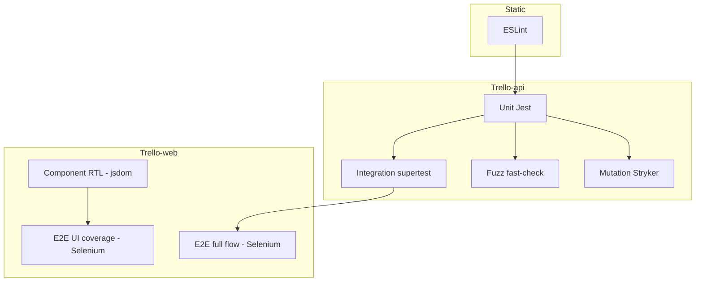

# Tổng hợp kỹ thuật kiểm thử — Trello MERN

> Tổng hợp các kỹ thuật kiểm thử và bài test được áp dụng trong toàn bộ dự án (`Trello-api` + `Trello-web`).
> Nguồn: `docs/TEST_PLAN.md`, `docs/TEST_CASES.md`, 20 file test trong repo, `.github/workflows/test.yml`, `stryker.conf.json`.

---

## Tổng quan kiến trúc kiểm thử



| Cấp | Repo | Công cụ | Thư mục |
|-----|------|---------|---------|
| Static | API + Web | ESLint | `npm run lint` |
| Unit (white-box) | API | Jest | `Trello-api/src/tests/unit/` |
| Fuzz (property-based) | API | Jest + fast-check | `Trello-api/src/tests/fuzz/` |
| Integration (black-box API) | API | Jest + supertest | `Trello-api/src/tests/integration/` |
| Component | Web | Jest + RTL + jsdom | `Trello-web/src/tests/components/` |
| E2E / System | Web | Selenium WebDriver + Chrome | `Trello-web/src/tests/selenium/` |
| Mutation | API | Stryker + Jest | `Trello-api/stryker.conf.json` |

**CI** (`.github/workflows/test.yml`): API chạy `test`, `test:coverage`, `test:fuzz`, `lint`; Web chạy `test`, `lint`; mutation chạy riêng (`continue-on-error: true`). **Selenium không chạy trên CI** (cần FE/BE + Chrome local).

---

## 1. Kiểm thử tĩnh (Static analysis)

| Kỹ thuật | Mục đích | Cách chạy |
|----------|----------|-----------|
| Static analysis | Phát hiện lỗi cú pháp, style, anti-pattern | `npm run lint` (API + Web) |
| ID test case | `TC-STATIC-01` | ESLint 0 error |

---

## 2. Trello-api — Unit test (White-box)

**Kỹ thuật:** white-box, branch coverage, BVA (Boundary Value Analysis), EP (Equivalence Partitioning), mock/stub (Jest).

| File | Đối tượng | Kỹ thuật nổi bật |
|------|-----------|------------------|
| `auth.unit.test.js` | `authUtils` | Nhánh null/undefined/empty; BVA password length 5–7 |
| `board.unit.test.js` | `boardUtils` | BVA title rỗng, 255/256 ký tự |
| `card.unit.test.js` | `moveCard` | Nhánh card null, list null, same list, move OK + mock DB |
| `list.unit.test.js` | Joi column title | Black-box BVA/EP trên schema (2/3/50/51 chars) |
| `validations.unit.test.js` | middleware Joi | White-box: `next()` pass vs `422` |
| `authMiddleware.unit.test.js` | `isAuthorized` | Nhánh cookie/token hợp lệ / không hợp lệ |

**Oracle:** expected-value (`throw`, `{ valid: false, reason: 'TOO_SHORT' }`, `statusCode 422`).

**Môi trường:** `mongodb-memory-server` trong `setup.js` — DB in-memory, xóa collection sau mỗi test.

---

## 3. Trello-api — Integration test (Black-box API)

**Kỹ thuật:** black-box qua HTTP, supertest, test double (`jest.mock` email), session agent (cookie login).

| File | Luồng API |
|------|-----------|
| `auth.integration.test.js` | Register 201/422, verify, login + cookie, GET boards |
| `board.integration.test.js` | 401 không auth, POST board, GET chi tiết |
| `list.integration.test.js` | POST column |
| `card.integration.test.js` | POST card |

**Helper:** `integrationHelpers.js` — `getTestApp()`, `registerAndVerifyUser()`, `loginUser()`.

**Oracle:** HTTP status + body (`201`, `422`, `401`, `200`).

**ID:** `TC-INT-AUTH-*`, `TC-INT-BOARD-*`, `TC-INT-LIST-*`, `TC-INT-CARD-*`.

---

## 4. Trello-api — Fuzz test (Property-based)

**Kỹ thuật:** fuzz / property-based testing với fast-check (`fc.assert`, `fc.property`, arbitrary string/unicode/null/undefined).

| File | Property / contract |
|------|---------------------|
| `auth.fuzz.test.js` | `validateEmail` / `validatePassword` không crash; contract boolean / throw |
| `board.fuzz.test.js` | `validateBoardTitle` |
| `card.fuzz.test.js` | logic card utils |
| `validation.fuzz.test.js` | middleware validation với input ngẫu nhiên → pass hoặc `422` |

**Mục tiêu:** tìm crash, vi phạm contract khi input "xấu" (TC-FUZZ-01 … 09).

---

## 5. Trello-api — Mutation testing

**Kỹ thuật:** mutation testing (Stryker) trên logic utils.

- **Mutate:** `authUtils.js`, `boardUtils.js`, `cardUtils.js`
- **Runner:** Jest
- **Ngưỡng:** high 80%, low 60%, break 50%
- **Báo cáo:** `Trello-api/reports/mutation/mutation.html`
- **Chạy:** `npm run test:mutation` (TC-MUT-01)

Đánh giá chất lượng test unit: mutant bị "kill" hay sống sót.

---

## 6. Trello-web — Component test (RTL)

**Kỹ thuật:** component testing, black-box UI (theo spec), isolation qua mock.

| File | Component | Kỹ thuật |
|------|-----------|----------|
| `LoginForm.test.jsx` | Login | Render heuristic; `userEvent`; mock Redux/router/toast |
| `Board.test.jsx` | Board `_id` | Mock child (`BoardContent`, `AppBar`); kiểm tra loading / dispatch |
| `Card.test.jsx` | Card | Render title |
| `validators.test.js` | `singleFileValidator` | Unit logic upload |

**Công cụ:** `@testing-library/react`, `userEvent`, `jest-dom`, jsdom (không browser thật).

**Oracle:** heuristic (có nút "Login", spinner loading) + behavior (navigate, dispatch).

**ID:** `TC-RTL-LOGIN-*`, `TC-RTL-BOARD-*`, `TC-RTL-CARD-*`.

---

## 7. Trello-web — Selenium E2E

### 7.1 Hai lớp E2E

| Suite | File | Mục đích |
|-------|------|----------|
| UI pages coverage | `trello.selenium.test.js` | 12 scenario — cover route: login, register, 404, protected redirect, settings, board detail |
| Full user journey | `trello.full.selenium.test.js` | 1 scenario dài TC-E2E-FULL-01: login → board → 2 cột → card → DnD → edit → xóa → logout |

### 7.2 Kỹ thuật E2E áp dụng

| Kỹ thuật | Cách dùng trong project |
|----------|-------------------------|
| End-to-end / system testing | Browser Chrome thật (headless hoặc `E2E_HEADED=true`) |
| Page Object Model (POM) | `LoginPage`, `BoardPage`, `BoardsListPage`, `BoardDetailPage` |
| Testability hooks | `data-testid` trên form login, board, column, card, profile |
| Conditional execution | `maybeIt` + `E2E_RUN` + `E2E_TEST_EMAIL/PASSWORD` — thiếu env thì skip, không fail CI local |
| Session isolation | `clearSession()` — xóa cookie + `localStorage` (redux-persist) |
| Synchronization | `until.elementLocated/IsVisible`, `waitForAxiosIdle`, sleep MUI Zoom |
| React controlled inputs | `setReactInputValue` + dispatch `input`/`change` |
| DnD simulation | `simulateDnd` — chuỗi `mousedown`/`mousemove`/`mouseup` cho dnd-kit |
| Teardown / test data | `softDeleteBoard` qua API `_destroy` (UI chưa có nút xóa board) |
| Oracle | URL (`/boards`, `/login`), element visible, thứ tự cột, card trong cột |

### 7.3 Black-box vs validation

- **Verification:** UI hiển thị đúng trang, redirect đúng.
- **Validation:** user journey full flow giống thao tác thật (Coursera khóa 4).

---

## 8. Kỹ thuật thiết kế test case (theo `TEST_CASES.md`)

| Kỹ thuật | Ví dụ trong dự án |
|----------|-------------------|
| Equivalence Partitioning (EP) | Email valid/invalid; register body partition |
| Boundary Value Analysis (BVA) | Password length 5/6/7; board title 1/255/256; column 2/3/50/51 chars |
| Branch testing | `moveCard`, `validateEmail`, `authMiddleware` |
| Category partition | Bảng email × password → 422/201 |
| Expected-value oracle | API status, utils return object |
| Heuristic oracle | RTL: có nút Login; E2E: có "Your boards" |
| Consistency oracle | Sau login URL chứa `/boards` |
| Regression | Toàn bộ suite Jest + E2E khi sửa flow |

Quy ước ID: `TC-BB-*`, `TC-WB-*`, `TC-INT-*`, `TC-RTL-*`, `TC-E2E-*`, `TC-FUZZ-*`, `TC-MUT-*`.

---

## 9. Mock & cô lập phụ thuộc

| Lớp | Mock |
|-----|------|
| Integration API | `SendEmailProvider` — không gửi email thật |
| Unit card | `findById`, `save` DB giả |
| RTL | Redux, router, API modules, child components |
| E2E | Không mock UI; gọi API thật (localhost:8017) khi cần cleanup |

---

## 10. Ma trận: kỹ thuật × loại test

| | Unit | Integration | Fuzz | Mutation | RTL | Selenium |
|--|:---:|:---:|:---:|:---:|:---:|:---:|
| White-box | ✓ | | ✓ | ✓ | một phần | |
| Black-box | EP/BVA Joi | ✓ | | | ✓ | ✓ |
| BVA / EP | ✓ | ✓ | | | | |
| Property-based | | | ✓ | | | |
| Mock/Stub | ✓ | ✓ | ✓ | | ✓ | |
| Real browser | | | | | | ✓ |
| Real DB | | ✓ (memory) | ✓ | ✓ | | ✓ (E2E) |

---

## 11. Lệnh chạy nhanh

```bash
# API
cd Trello-api
npm test              # unit + integration + fuzz
npm run test:unit
npm run test:integration
npm run test:fuzz
npm run test:mutation
npm run test:coverage

# Web
cd Trello-web
npm test              # RTL + validators
npm run test:e2e      # Selenium (cần FE + BE + .env E2E_*)
```

---

## 12. Ngoài phạm vi (theo TEST_PLAN)

- Performance (JMeter)
- Mobile (Appium)
- Email thật trong test
- Selenium trên GitHub Actions (chưa cấu hình)

---

**Tóm lại:** Dự án áp dụng pyramid đầy đủ cho khóa Software Testing: static → unit (WB + BVA/EP) → integration API (BB) → fuzz → mutation → RTL component → Selenium E2E (smoke UI + full flow), có tài liệu `TEST_PLAN` / `TEST_CASES` và CI cho phần lớn lớp trừ E2E browser.
